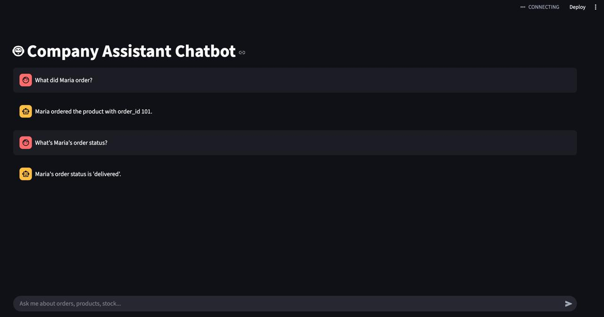

# 🤖 Company Chatbot – GPT-Powered Assistant for SQL Databases

This is a smart AI chatbot that connects **OpenAI's GPT-3.5** with a **company database** using **LangChain**. It answers customer or business questions in plain language by querying a real SQLite database — all through an interactive **Streamlit web app**.

---

## 🧠 What It Can Do

- Understand questions like:  
  👉 “What is the status of order 102?”  
  👉 “Which products are out of stock?”  
  👉 “What did Maria T. order?”  
  👉 “How many orders has customer ID 25 placed?”

- Automatically:
  - 🧠 Understands the question using GPT
  - 🔎 Chooses the right SQL query to answer it
  - 📊 Executes the query on the database
  - 💬 Returns the result in natural language

---

## 🛠 Built With

| Tool           | Purpose                             |
|----------------|-------------------------------------|
| Python         | Core language                       |
| LangChain      | Agent, tool and memory handling     |
| OpenAI         | GPT-3.5 model                       |
| SQLite         | Example company database            |
| Streamlit      | User interface (chat-style)         |
| SQLAlchemy     | Database access layer               |
| Python-dotenv  | Secure API key management           |

---

## 📸 Screenshot



*(Add your own screenshot if you want)*

---

## 🚀 How to Run It Locally

### 1. Clone the Repo

```bash
git clone https://github.com/yourusername/company-chatbot-sql.git
cd company-chatbot-sql
```

### 2. Create a Virtual Environment (Optional but Recommended)

```bash
python -m venv venv
source venv/bin/activate  # or venv\Scripts\activate on Windows
```

### 3. Install the Requirements

```bash
pip install -r requirements.txt
```

### 4. Add Your OpenAI API Key

Create a file called `.env` in the root folder:

```bash
touch .env
```

Inside it, paste:

```
OPENAI_API_KEY=your-openai-key-here
```

(You can get an API key at https://platform.openai.com/account/api-keys)

### 5. Run the App

```bash
streamlit run chatbot_app.py
```

Your chatbot will launch in the browser!

---

## 🧾 Example Database

This project includes a mock database `mock_company.db` with sample tables like:

- `orders`
- `customers`
- `products`

You can replace it with your own company data as long as it follows SQL standards.

---

## 🔒 Security Notes

- This app runs locally and never sends your data anywhere except OpenAI’s API.
- Do not expose your real `.env` file publicly — use `.env.example` instead.

---

## 💼 Use Cases

- Customer service bot
- Business intelligence assistant
- Internal tool for support teams
- AI + SQL learning project

---

## 🧠 How It Works Internally

1. The user types a question in plain language
2. LangChain's **AgentExecutor** uses GPT to:
   - Decide if it needs to use a tool (like SQL)
   - Build and validate the SQL query
   - Run the query
3. The result is shown in a friendly format

Optionally, it uses memory to:
- Track past questions and answers
- Handle follow-up questions naturally

---

## 📦 File Structure

```
📁 company-chatbot-sql/
├── chatbot_app.py         ← Main Streamlit app
├── mock_company.db        ← SQLite company database
├── requirements.txt       ← Project dependencies
├── .env.example           ← Sample API key config
└── README.md              ← This file
```

---

## 📄 License

This project is open-source under the [MIT License](LICENSE).

---

## 🙋 About the Author

Built by [Dimitrios Diamantidis](https://github.com/yourusername), a data specialist who loves combining AI with real business tools.

---

## ⭐ Like This Project?

Feel free to fork it, give it a ⭐️, or connect with me on [LinkedIn](https://www.linkedin.com/in/yourprofile) to chat more about AI & data projects!
