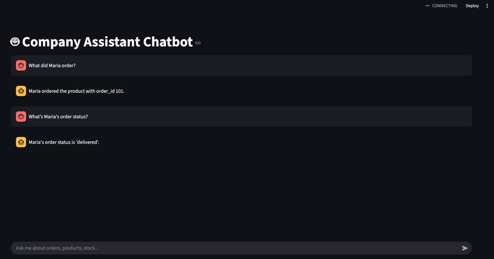

# Company Chatbot — Natural-Language SQL Assistant

Ask questions about a company database in plain English and get answers back.
The app connects an OpenAI chat model to a SQLite database through a LangChain
SQL agent, all behind a Streamlit chat interface.

## What it does

You type a question, the agent decides what SQL to run, runs it, and returns the
answer in natural language. Example questions:

- "What is the status of order 102?"
- "Which products are out of stock?"
- "What did Maria T. order?"
- "How many orders has customer ID 25 placed?"

## How it works

1. The user asks a question in plain English.
2. The LangChain SQL agent inspects the database schema and writes a SQL query.
3. The query runs against the SQLite database.
4. The agent returns the result as a natural-language answer.

## Results

Tested on a set of questions against `mock_company.db`. Accuracy below is whether
the returned answer matched the correct value in the database.

| Question | SQL generated (summary) | Correct? |
|---|---|---|
| Status of order 102? | `SELECT status FROM orders WHERE id = 102` | Yes |
| Products out of stock? | `SELECT name FROM products WHERE stock = 0` | Yes |
| Orders placed by customer 25? | `SELECT COUNT(*) FROM orders WHERE customer_id = 25` | Yes |
| _(add the rest of your tested cases here)_ | | |

> Replace this table with your own results. Run `eval.py` (below) to generate it,
> then paste in the real numbers and note any questions the agent got wrong and why.

## Built with

| Tool | Purpose |
|---|---|
| Python | Core language |
| LangChain | SQL agent and tooling |
| OpenAI | Chat model (gpt-4o-mini) |
| SQLite | Example company database |
| Streamlit | Chat interface |
| python-dotenv | API key management |

## Screenshot



## Run it locally

```bash
# 1. Clone
git clone https://github.com/dimitrisdiam/company-chatbot-sql.git
cd company-chatbot-sql

# 2. Create a virtual environment
python -m venv venv
source venv/bin/activate        # Windows: venv\Scripts\activate

# 3. Install dependencies
pip install -r requirements.txt

# 4. Add your OpenAI API key
cp .env.example .env            # then edit .env and paste your key
```

Your `.env` should contain:

```
OPENAI_API_KEY=your-openai-key-here
```

Get a key at https://platform.openai.com/account/api-keys.

```bash
# 5. Run
streamlit run chatbot_app.py
```

## Example database

`mock_company.db` is a small SQLite database with `orders`, `customers`, and
`products` tables. Swap in your own data with the same structure to use it on a
real database.

## Security notes

The app runs locally and sends data only to the OpenAI API. Never commit your
real `.env` — commit `.env.example` instead.

## Author

Built by Dimitrios Diamantidis.
